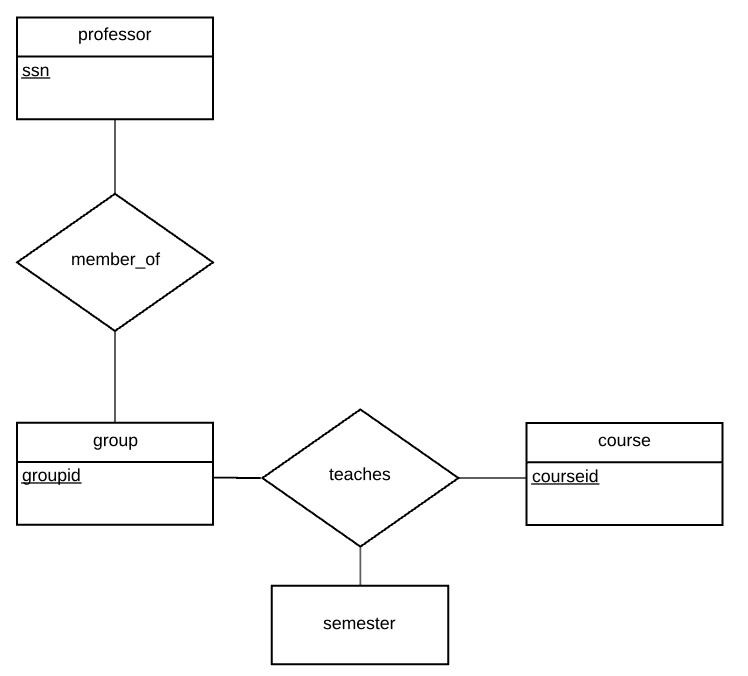

# Une base de données universitaire

Une base de données universitaire contient des informations sur les professeurs
(identifié par le numéro de sécurité sociale ou SSN) et les cours
(identifié par courseid). Les professeurs donnent des cours; chacun de
les situations suivantes concernent l'ensemble de relation `teaches`.

## Diagramme ER

Pour chaque situation voici un diagramme ER qui le décrit
(en supposant qu'aucune autre contrainte).

1) Les professeurs peuvent enseigner le même cours sur plusieurs semestres et seule la plus récente doit être enregistrée.


2) Chaque professeur doit enseigner un cours.


3) Chaque professeur enseigne exactement un cours (ni plus, ni moins).


4) Chaque professeur enseigne exactement un cours (ni plus, ni moins), et chaque cours doit être enseigné par un professeur.


5) Les professeurs peuvent enseigner le même cours sur plusieurs semestres et chaque doit être enregistrée.


6) Supposons maintenant que certains cours puissent être enseignés conjointement par une équipe de professeurs, mais il est possible qu'aucun professeur dans une équipe ne puisse enseigner le cours. Modélisez cette situation en introduisant des ensembles d'entités et des ensembles de relations supplémentaires si nécessaire.



## Diagramme de relation

Avec les diagrammes ER ci-dessus, modèlez un diagramme relationnel pour les systèmes.

1) Les professeurs peuvent enseigner le même cours sur plusieurs semestres et seule la plus récente doit être enregistrée.


2) Chaque professeur doit enseigner un cours.


3) Chaque professeur enseigne exactement un cours (ni plus, ni moins).


4) Chaque professeur enseigne exactement un cours (ni plus, ni moins), et chaque cours doit être enseigné par un professeur.


5) Les professeurs peuvent enseigner le même cours sur plusieurs semestres et chaque doit être enregistrée.


6) Supposons maintenant que certains cours puissent être enseignés conjointement par une équipe de professeurs, mais il est possible qu'aucun professeur dans une équipe ne puisse enseigner le cours. Modélisez cette situation en introduisant des ensembles d'entités et des ensembles de relations supplémentaires si nécessaire.


## Schèma de relation

Avec les diagrammes relationnel ci-dessus, écrivez un schéma SQL relationnel pour les systèmes.

1) Les professeurs peuvent enseigner le même cours sur plusieurs semestres et seule la plus récente doit être enregistrée.

```sql
CREATE TABLE professors(
	ssn integer, 
	primary key (ssn)
);

CREATE TABLE courses(
	courseid varchar(100), 
	primary key (courseid)
);

CREATE TABLE teaches(
	ssn integer,
	courseid varchar(100),
	semesterid varchar(100), 
	primary key (ssn, courseid),
	foreign key (ssn) references professors,
	foreign key (courseid) references courses
);
```

2) Chaque professeur doit enseigner un cours.


```sql
CREATE TABLE professors(
	ssn integer, 
	primary key (ssn)
);

CREATE TABLE courses(
	courseid varchar(100), 
	primary key (courseid)
);

CREATE TABLE teaches(
	ssn integer,
	courseid varchar(100),
	semesterid varchar(100), 
	primary key (ssn, courseid),
	foreign key (ssn) references professors,
	foreign key (courseid) references courses
);
```
3) Chaque professeur enseigne exactement un cours (ni plus, ni moins).

```sql
CREATE TABLE professors(
	ssn integer, 
	primary key (ssn)
);

CREATE TABLE courses(
	courseid varchar(100), 
	primary key (courseid)
);

CREATE TABLE teaches(
	ssn integer,
	courseid varchar(100),
	semesterid varchar(100), 
	primary key (ssn),
	foreign key (ssn) references professors
);
```

4) Chaque professeur enseigne exactement un cours (ni plus, ni moins), et chaque cours doit être enseigné par un professeur.

```sql
CREATE TABLE professors(
	ssn integer, 
	primary key (ssn)
);

CREATE TABLE courses(
	courseid varchar(100), 
	primary key (courseid)
);

CREATE TABLE teaches(
	ssn integer,
	courseid varchar(100),
	semesterid varchar(100), 
	primary key (ssn),
	foreign key (ssn) references professors);
```

5) Les professeurs peuvent enseigner le même cours sur plusieurs semestres et chaque doit être enregistrée.

```sql
CREATE TABLE professors(
	ssn integer, 
	primary key (ssn)
);

CREATE TABLE courses(
	courseid varchar(100), 
	primary key (courseid)
);

CREATE TABLE teaches(
	ssn integer,
	courseid varchar(100),
	semesterid varchar(100), 
	primary key (ssn, courseid, semesterid),
	foreign key (ssn) references professors,
	foreign key (courseid) references courses
);
```

6) Supposons maintenant que certains cours puissent être enseignés conjointement par une équipe de professeurs, mais il est possible qu'aucun professeur dans une équipe ne puisse enseigner le cours. Modélisez cette situation en introduisant des ensembles d'entités et des ensembles de relations supplémentaires si nécessaire.

```sql
CREATE TABLE professors(
	ssn integer, 
	primary key (ssn)
);

CREATE TABLE courses(
	courseid varchar(100), 
	primary key (courseid)
);

CREATE TABLE groups(
	groupid varchar(100),
	primary key (groupid)
);

CREATE TABLE member_of(
	ssn integer, 
	groupid varchar(100),
	primary key (ssn, groupid),
	foreign key (ssn) references professors,
	foreign key (groupid) references groups
);


CREATE TABLE teaches(
	groupid varchar(100),
	courseid varchar(100),
	semesterid varchar(100), 
	primary key (groupid, courseid, semesterid),
	foreign key (groupid) references groups,
	foreign key (courseid) references courses
);
```