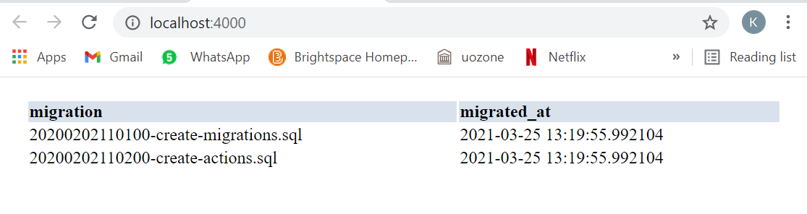
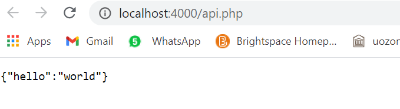

# CSI 2532- lab 8- API Tokens

| Student Name            | Student Number |
| ----------------------- | -------------- |
| Amber Kate Sin Yan Chun | 300144923      |

## Exercise 1 : Configure PHPAPP

The sample phpapp was setup successfully.

 

## Exercise 2: Create a Client

Run this migration to create the table client.

```
\i db/202104071045-create-client.sql;
```

## Exercise 3: Create API

The new [PHP file](public/api.php) has been created.

Testing our server, the output was 


